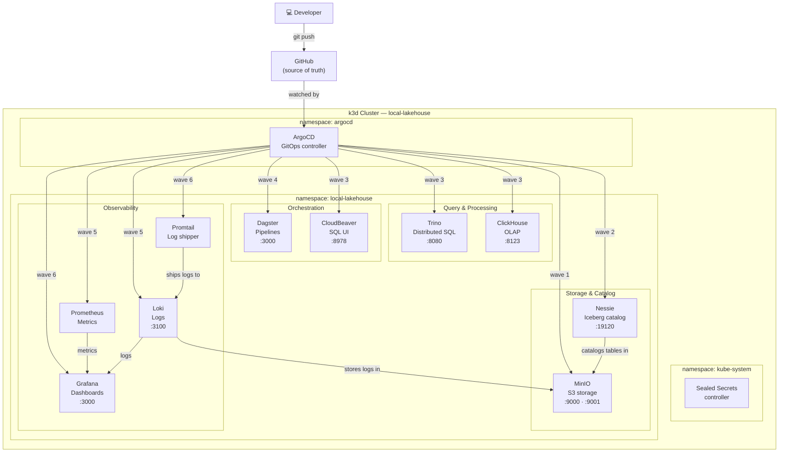
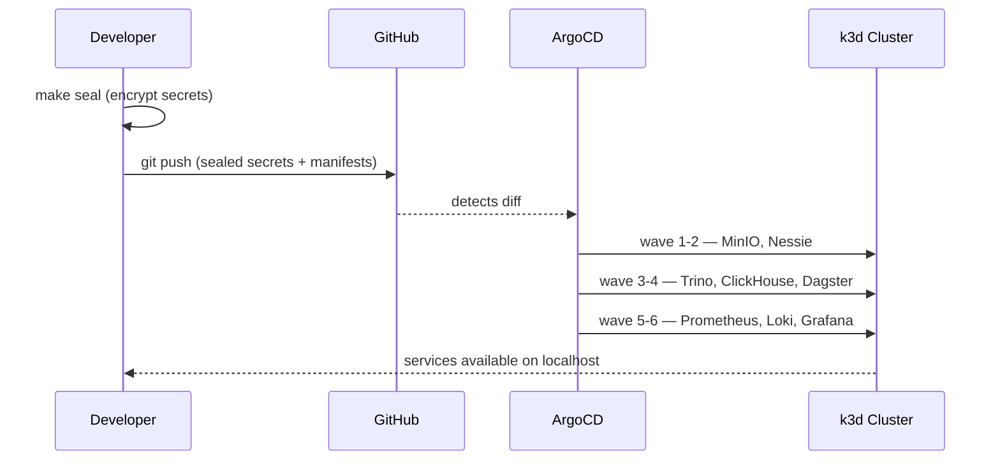
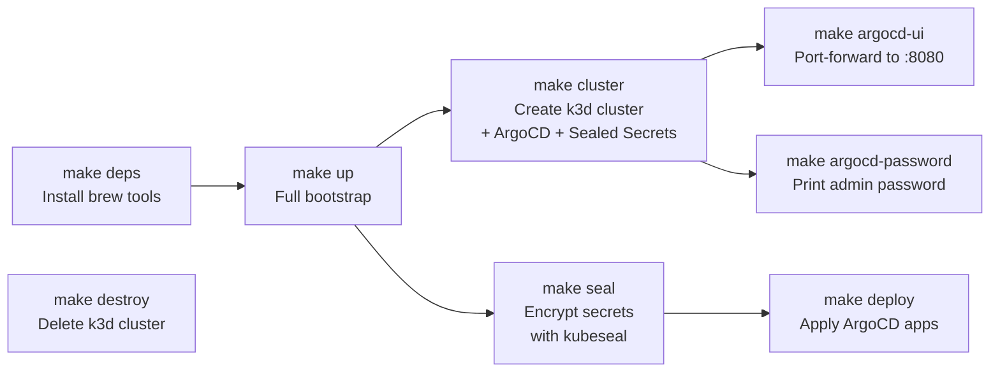
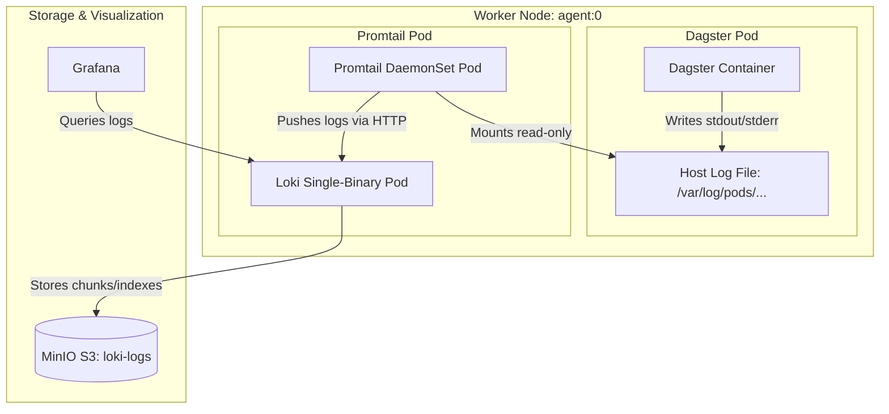
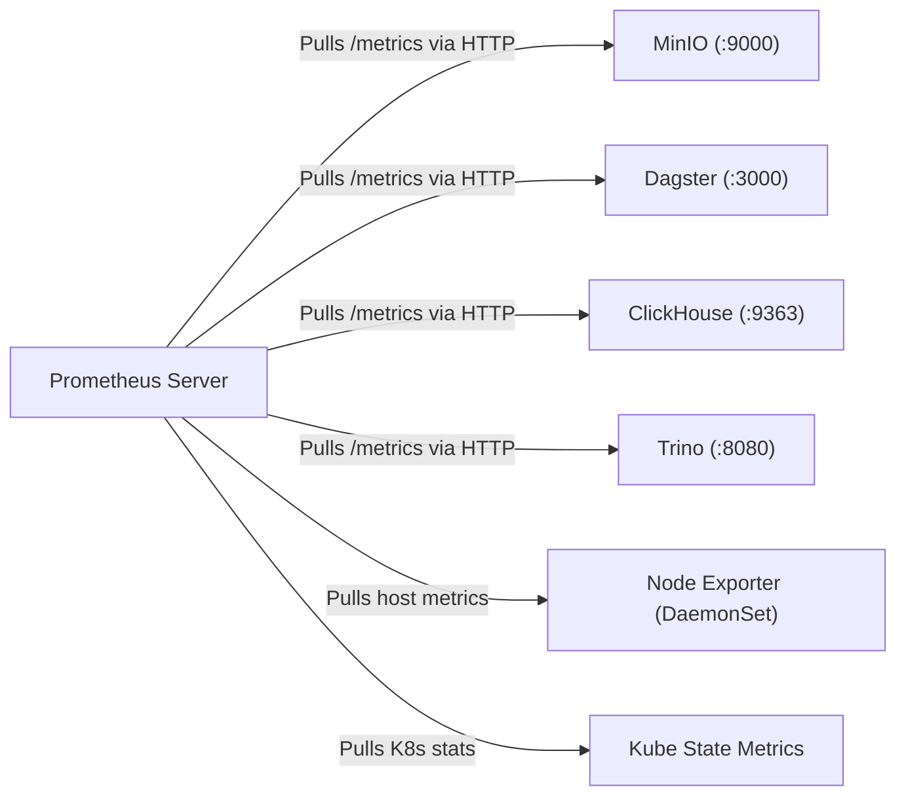

# Local Datalake

A local Kubernetes-based datalake for learning purposes. Runs entirely on your laptop using k3d (k3s in Docker), with GitOps managed by ArgoCD.

## Architecture



### GitOps Flow



## Services

| Service | Role | Port |
|---------|------|------|
| MinIO | S3-compatible object storage (Bronze/Silver/Gold + Loki buckets) | 9000 (API), 9001 (UI) |
| Nessie | Git-like catalog for Iceberg table versioning | 19120 |
| Trino | Distributed SQL query engine over Iceberg tables | 8080 |
| ClickHouse | Columnar OLAP database for fast analytics | 8123 |
| Dagster | Pipeline orchestration with Celery workers | 3000 |
| CloudBeaver | Web-based SQL client for Trino/ClickHouse | 8978 |
| Prometheus | Metrics collection (MinIO, Dagster, Trino, ClickHouse, cluster) | — |
| Loki | Log aggregation backed by MinIO S3 | 3100 |
| Promtail | DaemonSet log shipper — collects all pod logs and sends to Loki | — |
| Grafana | Dashboards for metrics and logs (pre-wired to Prometheus + Loki) | 3000 |
| ArgoCD | GitOps controller — syncs the cluster to this repo | 8080 |

## Prerequisites

Make sure Docker is installed and running, then install the rest with Homebrew:

```bash
make deps
# equivalent to: brew install k3d kubectl helm kubeseal
```

## Quickstart

```bash
# 1. Bootstrap the cluster (run once)
make up

# 2. Access the ArgoCD UI
make argocd-ui        # port-forwards to https://localhost:8080
make argocd-password  # prints the admin password
```

ArgoCD pulls from GitHub and deploys all services in sync-wave order (storage → catalog → query → orchestration → observability).

## Makefile Reference



| Command | Description |
|---------|-------------|
| `make help` | List all available commands |
| `make deps` | Install prerequisites via Homebrew (macOS only) |
| `make up` | Full bootstrap: create cluster → seal secrets → push → deploy |
| `make cluster` | Create k3d cluster + install ArgoCD + Sealed Secrets |
| `make seal` | Encrypt secrets with kubeseal (run before committing secrets) |
| `make deploy` | Apply all ArgoCD Application manifests |
| `make destroy` | Delete the k3d cluster |
| `make argocd-ui` | Port-forward ArgoCD UI to `https://localhost:8080` |
| `make argocd-password` | Print the ArgoCD admin password |

## Accessing Services

**ArgoCD UI:**
```bash
make argocd-ui        # port-forward to https://localhost:8080
make argocd-password  # print admin password
```

**MinIO UI:** `http://localhost:9001` (minioadmin / minioadmin123)

**Grafana:** `http://localhost:3000` (admin / admin — via sealed secret)
```bash
kubectl port-forward svc/grafana 3000:80 -n local-lakehouse
```

**Dagster UI:**
```bash
kubectl port-forward svc/dagster-dagster-webserver 3000:80 -n local-lakehouse
```

**Trino:** `http://localhost:8080` · **ClickHouse:** `http://localhost:8123` · **CloudBeaver:** `http://localhost:8978` · **Nessie API:** `http://localhost:19120`

## Deployment Sync-Waves

| Wave | Services |
|------|---------|
| 1 | MinIO |
| 2 | Nessie |
| 3 | Trino, ClickHouse, CloudBeaver |
| 4 | Dagster |
| 5 | Prometheus, Loki |
| 6 | Promtail, Grafana |

## Grafana Dashboards

Six dashboards are pre-provisioned at startup:

| Dashboard | What it shows |
|-----------|--------------|
| Kubernetes Cluster | Node CPU/memory, pod counts |
| Node Exporter | Disk, network, system metrics |
| MinIO | Request rate, storage usage, errors |
| Loki Logs | Log volume and streams by namespace |
| Trino | Query counts and JVM metrics |
| Kubernetes Namespaces | Per-namespace resource usage |

## Observability Architecture

This datalake stack separates observability data into **Logs** and **Metrics** to optimize collection, storage, and querying.

### 1. Log Collection (Loki & Promtail)

Loki uses a **push-based model** facilitated by **Promtail** (deployed as a DaemonSet to run on every node).



*   **Host Logs**: The standard output (`stdout`/`stderr`) of all pods (like Dagster, ClickHouse, etc.) is captured by Kubernetes and written as log files on the host node at `/var/log/pods/`.
*   **Log Shipper**: The `promtail` DaemonSet mounts `/var/log/pods/` read-only, continuously tails these files, enriches the logs with Kubernetes metadata (namespace, pod name, container name), and pushes them to `loki`.
*   **Storage**: Loki groups log lines into streams and writes the compressed log chunks directly to MinIO (`loki-logs` bucket).

### 2. Metrics Collection (Prometheus)

Prometheus uses a **pull-based (scrape) model**. Instead of utilizing an agent to push data, Prometheus periodically makes HTTP `GET` requests to retrieve metrics from `/metrics` endpoints.



*   **Cluster Metrics**: Prometheus employs `prometheus-node-exporter` (for physical node RAM/CPU/disk metrics) and `kube-state-metrics` (for Kubernetes resource states).
*   **Custom Scrapers**: Explicit scrape jobs are configured in the stack to pull metrics from key components:
    *   **MinIO**: `/minio/v2/metrics/cluster` (port 9000)
    *   **Dagster**: `/metrics` (port 3000)
    *   **Trino**: `/v1/jmx/mbean/java.lang:type=Memory` (port 8080)
    *   **ClickHouse**: `/metrics` (port 9363)

### 3. Summary of Observability Flow

| Telemetry Type | Collector | Model | Storage Backend | Pre-configured Dashboards |
| :--- | :--- | :--- | :--- | :--- |
| **Logs** (Textual events) | **Promtail** (DaemonSet) | **Push** | Loki (backed by MinIO S3) | Loki Logs |
| **Metrics** (Numeric measurements) | **Prometheus** | **Pull** | Prometheus TSDB | Node Exporter, Kubernetes Namespaces, MinIO, Trino |

## Project Structure

```
argocd/appsets/               ArgoCD Application manifests (one per service)
docs/               Architecture Decision Records and implementation plans
infra/              Cluster setup + all infrastructure components
  cluster.yaml      k3d cluster config
  <service>/        One directory per service
    application/    Helm chart (Chart.yaml, values.yaml, templates/)
    infrastructure/ Terragrunt placeholder (N/A locally, used in cloud envs)
```

## Adding a New Service

Use the `/new-service` skill in Claude Code — it scaffolds the Helm chart structure and ArgoCD Application manifest automatically.

## License

MIT
